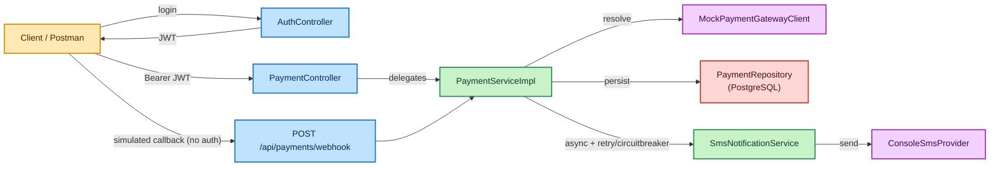

# MiniPay – Payment & Notification Microservice


A mock payment processing microservice with asynchronous SMS notifications, built with Spring Boot 3.

## Architecture



*Orange = client, blue = controller, green = service, purple = integration, red = persistence.*

Layers: `controller` → `service` → `repository` / `integration` (gateway, sms). DTOs and entities are mapped via MapStruct (`mapper` package). Cross-cutting config lives in `config`; errors are centralized in `exception`.

## Payment flow

`POST /api/payments` persists the payment as `PENDING`, then **synchronously** calls the mock gateway (no real network latency to simulate) and immediately persists the resolved `SUCCESS`/`FAILED` status. If `SUCCESS`, an SMS notification is dispatched asynchronously.

The `POST /api/payments/webhook` endpoint is a separate, independent simulation of an asynchronous provider callback — useful for demoing the callback-driven flow on its own. It is **idempotent**: calling it on a payment that is already in a terminal state (`SUCCESS`/`FAILED`) is a no-op and does not re-trigger notifications.

## Authentication (JWT)

Stateless JWT auth, with two in-memory demo users (no registration flow, per the assignment scope):

| Username | Password   | Role        |
|----------|------------|-------------|
| `dlightadmin`  | `bJopnie@uu` | `ROLE_ADMIN`|
| `dlightuser`   | `njffd@4@bhfd`  | `ROLE_USER` |

```bash
curl -X POST http://localhost:8080/api/auth/login \
  -H "Content-Type: application/json" \
  -d '{"username": "dlightadmin", "password": "bJopnie@uu"}'
```

Returns `{"accessToken": "...", "tokenType": "Bearer", "expiresInSeconds": 3600}`. Send it back as `Authorization: Bearer <accessToken>`.

Authorization rules (`SecurityConfig`):

| Endpoint                      | Access              |
|--------------------------------|---------------------|
| `POST /api/auth/login`        | public              |
| `POST /api/payments/webhook`  | public (provider callback simulation, not a user action) |
| `POST /api/payments`          | `ROLE_ADMIN` or `ROLE_USER` |
| `GET /api/payments/{id}`      | `ROLE_ADMIN` or `ROLE_USER` |
| `GET /api/payments`           | `ROLE_ADMIN` only (full transaction history) |
| Swagger UI, `/v3/api-docs/**`, `/actuator/health`, `/actuator/info` | public |

Missing/invalid token → `401`; authenticated but wrong role → `403` (both as JSON via `JwtAuthenticationEntryPoint`/`JwtAccessDeniedHandler`, same `ErrorResponse` shape as the rest of the API).

## Resilience (Retry + Circuit Breaker)

`SmsNotificationService.notifyPaymentSuccess` is wrapped with Resilience4j `@Retry` (outer, with `fallbackMethod`) and `@CircuitBreaker` (inner) around the `SmsProvider` call — configured under `resilience4j.*` in `application.yml`:

- **Retry**: up to 3 attempts with exponential backoff (200ms, then 400ms).
- **Circuit breaker**: opens once ≥50% of the last 10 calls fail (minimum 5 calls evaluated), short-circuiting further attempts for 10s.
- **Fallback**: once retries are exhausted, logs `notification_failed` instead of throwing — failures never escape the `@Async` executor uncaught.

The fallback is intentionally on `@Retry`, not `@CircuitBreaker`: Spring's default aspect order here runs Retry outside CircuitBreaker, so a fallback on the inner `@CircuitBreaker` would swallow the exception after the very first attempt and starve Retry of anything to retry.

## Tradeoffs and assumptions

> [!NOTE]
> - **PostgreSQL only, no H2.** The assignment allows H2 or PostgreSQL; we use PostgreSQL exclusively (with Flyway migrations and Testcontainers in tests) to stay closer to production behavior.
> - **Bounded `@Async` executor as the in-memory SMS queue.** `AsyncConfig` defines a `ThreadPoolTaskExecutor` (`notificationExecutor`) with a bounded queue — this queue is the "simple in-memory queue" called for as an SMS fallback mechanism, rather than a separate queue data structure.
> - **Swagger instead of a separate Postman collection.** The "Postman Collection or Swagger link" deliverable is satisfied via Swagger UI (see below).
> - **JWT auth uses in-memory demo users**, not a user registration/database flow — out of scope for this assignment.
> - **`transactionReference` format:** `TXN-<yyyyMMddHHmmss>-<8-char random alphanumeric>`, generated at creation time.

## Tech stack


## Running locally

### Option A: Docker Compose (app + Postgres)

```bash
docker-compose up --build
```

The app starts on `http://localhost:8080` against a containerized Postgres.

### Option B: Local Postgres + Maven

1. Start a local Postgres matching `application-dev.yml` (db `minipay`, user/password `minipay`), or run just the `postgres` service from `docker-compose.yml`:
   ```bash
   docker-compose up postgres
   ```
2. Run the app:
   ```bash
   ./mvnw spring-boot:run
   ```
   Defaults to the `dev` profile. Override with `SPRING_PROFILES_ACTIVE=prod` (requires `DB_URL`, `DB_USERNAME`, `DB_PASSWORD` env vars) for the production profile.

## API examples

All `/api/payments/**` endpoints except the webhook require `Authorization: Bearer <token>` — see [Authentication](#authentication-jwt) above to obtain one.

**Initiate a payment**
```bash
curl -X POST http://localhost:8080/api/payments \
  -H "Authorization: Bearer $TOKEN" \
  -H "Content-Type: application/json" \
  -d '{"amount": 500.00, "phoneNumber": "254712345678", "paymentMethod": "MPESA"}'
```

**Get payment status**
```bash
curl http://localhost:8080/api/payments/{id} -H "Authorization: Bearer $TOKEN"
```

**Transaction history (paged, filtered, ADMIN only)**
```bash
curl "http://localhost:8080/api/payments?status=SUCCESS&page=0&size=20" -H "Authorization: Bearer $ADMIN_TOKEN"
```

**Simulate a webhook callback**
```bash
curl -X POST http://localhost:8080/api/payments/webhook \
  -H "Content-Type: application/json" \
  -d '{"paymentId": "{id}", "status": "SUCCESS"}'
```

Mock gateway rule (deterministic mode, default): amount ≤ 10000 → `SUCCESS`, amount > 10000 → `FAILED`. Switch to `minipay.gateway.mode=random` (see `application.yml`) for a configurable random success rate.

## Swagger / OpenAPI

Once running: `http://localhost:8080/swagger-ui.html`

## Testing

```bash
./mvnw test
```

- **Unit tests** (Mockito): `PaymentServiceImplTest`, `MockPaymentGatewayClientTest`, `SmsNotificationServiceTest`, `JwtServiceTest`.
- **Integration tests** (Testcontainers PostgreSQL): `PaymentRepositoryIntegrationTest`, `PaymentControllerIntegrationTest` (incl. JWT auth/role checks), `AuthControllerIntegrationTest`, `SmsNotificationServiceResilienceTest` (exercises the real Retry/CircuitBreaker AOP proxy).

Requires Docker running locally (Testcontainers spins up a real Postgres container for integration tests).

## Actuator

- `/actuator/health`
- `/actuator/info`
- `/actuator/metrics`
